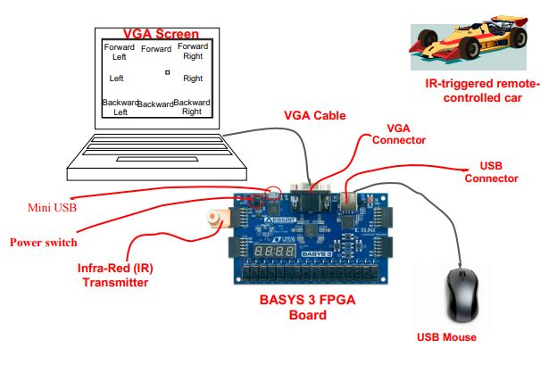
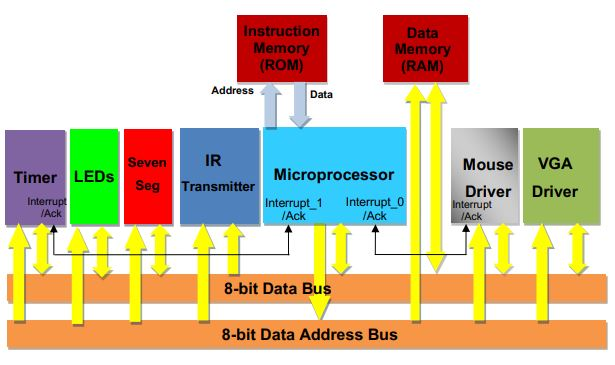

# microprocessor-rc
Verilog project of a simple microprocessor with peripherals such as mouse, VGA display and IR transmitter. Can be run on Xilinx Basys 3 FPGA board with an additional IR module in order to control a RC car. The system was developed for [Digital Systems Laboratory](http://www.drps.ed.ac.uk/20-21/dpt/cxelee10023.htm) course at The University of Edinburgh by:

* [Tomek Horszczaruk](https://github.com/thomson008)
* [Benjamin Young](https://github.com/benjamin-young)
* [Zheyu You](https://github.com/ZheyuYou)

The processor has its own ISA, containing 13 instructions and 2 registers.

## System diagram
Full system diagram can be seen in the figure below:

## Processor architecture
In order to understand the architecture of the microprocessor itself, please consult the following schematic:

## Application demo

A full video demonstration of the working system can be found [here](https://youtu.be/zi9BBTluCMY) on YouTube.

